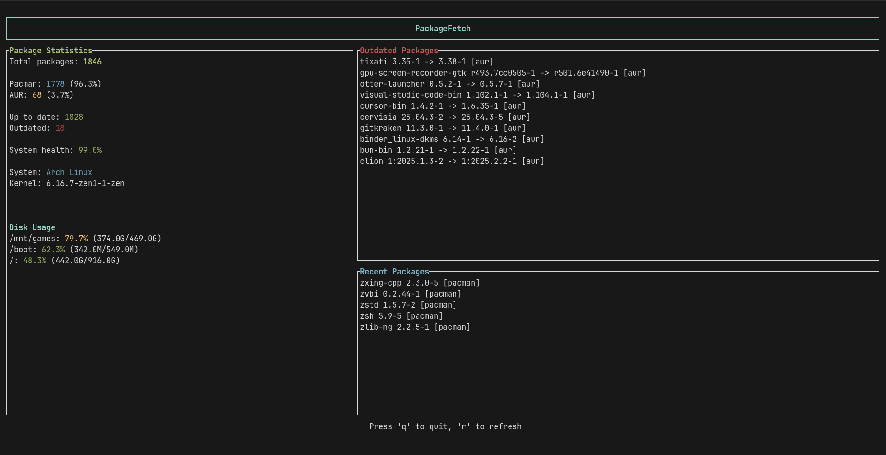

# PackageFetch 🐧



**PackageFetch** is a fetch-like terminal utility for **packages** written on rust.  
It gives you a fun and fast overview of your system's installed software.

---

## 🔹 Supported Systems

- Arch Linux and Arch-based distros  
- Debian, Ubuntu, and Debian-based distros  
- Fedora and Fedora-based distros  

---

## ✨ Features

- Display **total number of installed packages**  
- Show **package breakdown by source**, depending on the distro:
  - Arch / Arch-based: `pacman`, `AUR`, `Flatpak`  
  - Debian / Ubuntu: `apt`, `Flatpak`  
  - Fedora / Fedora-based: `dnf`, `Flatpak`
- Show **up-to-date (fresh) vs outdated packages** with source info  
- List **recently installed packages**  
- Display **system info**:
  - Linux distribution  
  - Kernel version  
  - Disk usage with percentage per mounted disk
- Fully **terminal-based** with minimal dependencies  

---

## 🚀 Get Started

Before you start, make sure you have **Rust** installed.

#### 1. Clone the repository

```bash
git clone https://github.com/BeanDx/PackageFetch.git
cd PackageFetch
```

#### 2. Build the project

```bash
cargo build --release
```

##### This will produce the binary at:

```text
target/release/package-fetch
```

#### 3. Install globally

Copy the binary to a folder in your `$PATH` so you can run it anywhere:

```bash
sudo cp target/release/package-fetch /usr/local/bin/
```

Now you can just run:

```bash
package-fetch
```
#### 4. Update
```bash 
git pull
```

```bash 
cargo build --release
```

```bash 
sudo cp target/release/package-fetch /usr/local/bin/
```

---

## 📝 Contribute

Have ideas or found bugs? Don’t hesitate to open **issues** or submit **feature requests**.  
All feedback is welcome!

---

## 🔗 Links

- [GitHub Repository](https://github.com/BeanDx/PackageFetch)  
- [tui-rs](https://github.com/fdehau/tui-rs)  
- [crossterm](https://github.com/crossterm-rs/crossterm)
